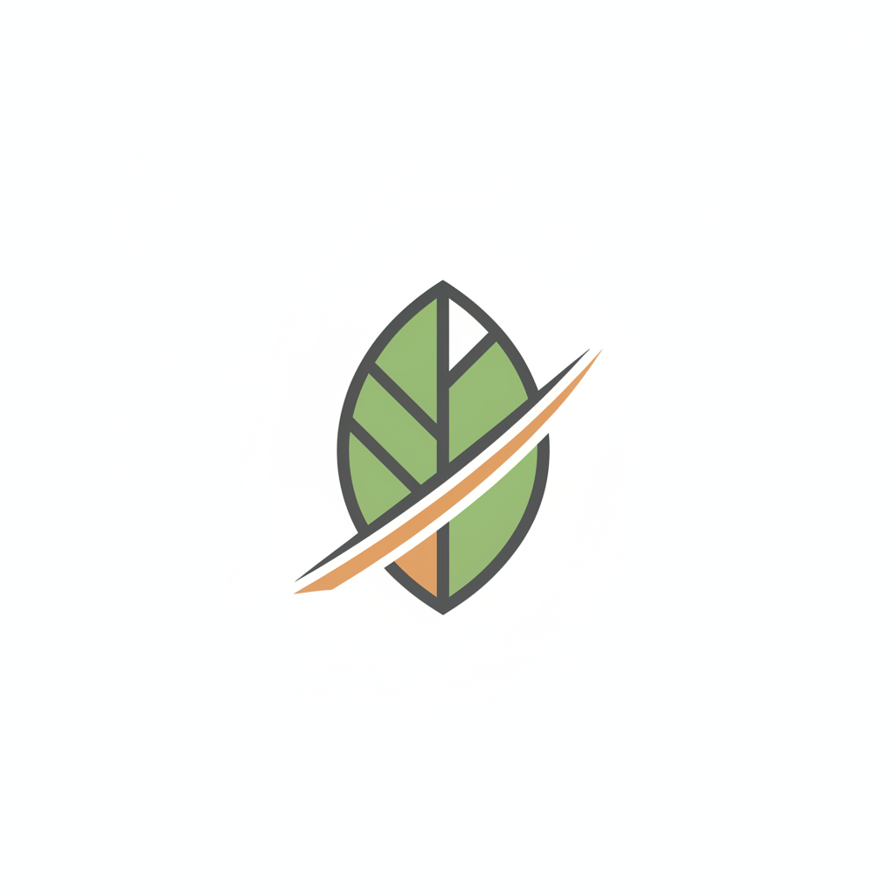

# TerraDash Brand Identity System

## 🎯 Brand Strategy

### Brand Foundation
**Purpose**: To eliminate the friction of home ownership by delivering instant, life-enhancing outdoor spaces.
**Vision**: To be the national standard for turnkey residential landscaping.
**Mission**: Transforming suburban dirt lots into fully-installed, automated gardens in a single 48-hour weekend.
**Values**: Speed, Reliability, Environmental Intelligence, and "Move-In" Simplicity.
**Personality**: Professional, efficient, tech-forward, and grounded.

### Brand Positioning
**Target Audience**: The "Move-In Max" Professional (32–48 years old, HHI $250k+, living in master-planned communities like Mueller, Austin).
**Competitive Differentiation**: While others sell a design or a multi-month project, TerraDash sells a *weekend result*.
**Brand Pillars**: 
1. **The 48-Hour Guarantee**: Predictable execution.
2. **Standardized Kits**: Regional expertise, pre-vetted.
3. **The Tech Gate**: Smart irrigation included to ensure survival.

---

## 🎨 Visual Identity

### Logo System

**Primary Logo**: A minimalist geometric leaf integrated with a motion "dash." It represents the intersection of nature and high-speed execution.
**Clear Space**: Maintain a minimum clear space equal to 50% of the logo's width on all sides.
**Minimum Size**: 40px for digital; 1.5 inches for physical (Squad uniforms).

### Color System
| Name | Hex | Usage |
| :--- | :--- | :--- |
| **TerraDark** | #1B3022 | Primary Backgrounds, Headers |
| **DashSlate** | #2C3E50 | Body Text, Secondary Buttons |
| **Sandstone** | #E6D5B8 | Background Accents, Soft Dividers |
| **Clay Accent** | #B35C44 | CTAs, Highlights, Brand Alerts |
| **Linen** | #F4F1EA | Primary App/Web Backgrounds |

### Typography
**Primary Typeface: Montserrat (Bold/ExtraBold)**
- Usage: Headlines, CTAs, Hero Text.
- Tone: Modern, fast, and authoritative.

**Secondary Typeface: Lora (Regular/Italic)**
- Usage: Body copy, testimonials, long-form guides.
- Tone: Premium, trustworthy, and organic.

---

## 🛡️ Brand Protection

### Trademark Strategy
Registration for the name "TerraDash" and the "Dirt to Done in 48" tagline across Class 37 (Construction; Landscaping) and Class 44 (Horticulture; Garden Design).

### Usage Guidelines
- The "Garden Squad" must always wear branded TerraDark polos during the Sunday walkthrough.
- All "After" photography must include a branded stake in the garden for 72 hours post-install.
- Smart irrigation notifications are the only touchpoint allowed to use the "Clay Accent" color to denote urgency.
